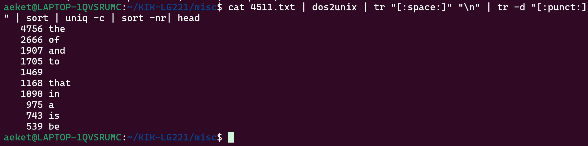

## Introduction

## Week 1: Introduction to Command Line Enviroments
The first week began by installing a command-line enviroment. In my case I used Ubuntu through WLS2, as I am a windows user. We then proceeded to familiarise ourselves with the basics of interacting with the command line. This included basic commands, such as:

| Command       | Description                        |
| ------------- | ---------------------------------- |
| `wget <URL>`  | Download a file from URL           |
| `ls`          | List contents of current directory |
| `pwd`         | Prints Current directory           |
| `whoami`      | Print current user                 |
| `mv`          | Move or rename file                | 
| `cat`         | Concatenate and print |
| `less` | Display file contents one page at a time|
| `cp` | Copy file to destination |
| `rm` | Remove file or directory |
| `mkdir` | Create directory |
| `cd` | Change working directory |

We then learned about quitting applications, which, deppending on the context, can be done with `Ctrl-d`, `Ctrl-c`, `Ctrl-x`, or `ESC`. Unfortunately, there is no universal way to quit applications and each one can potentially have their own. 

We then learned about text editors, like nano, and learned about the difference between text files and binary files. 

Beign a basic introcution to the command line, all of this week's information was useful to me in completing this course. By far the most useful part was discovering that I can use Linux on my Windows computer. I had previously tried to use PowerShell for some things, but that had proven somewhat too clunky to use regularly. Having WSL on my computer will, and indeed has, proven to be extremely useful. 

## Week 2: Navigating a UNIX system

The material for week 2 concerned the details of using the UNIX system. This included:

- Directories
	- Creating directories using `mkdir`
	- Deleting directories and their contents using `rm -R`
	- Copying directories using `cp -R`
	- Moving directories using `mv`
- UNIX file system 
	- The top most directory is called the root directory
		- The root directory's path is `/`
		- All other directories are sub-directories of the root directory
			- For example, all user home directories are contained in `/Users/`
			- `/bin/` contains essential user command binaries, such as the commands listed under Week 1
	- The `which` is used to locate the directory of a given command
	- The UNIX file system limits permissions for each file and directory. Permissions for reading, writing, and executing files can be individually configured for each user, group, and global user. 
		- These permissions can be managed using the command `chmod`.

We then went over how processes work. Running a command or programme starts a process. The operating system gives each program a process id for the purposes of keeping track of it. The command `top` can be used to see all processes currently running. By default, processes run in the forground, meaning once a process is started from the command line, the system will complete that process until a new command can be run. A process that is running in the foreground can be stoped using `Ctrl-C`. The command `ps aux` lists all currently running processes and their process ids. A process can be killed using the command `kill -9 <pid>`.

We then went over connecting to a remote server using `ssh` and securely copying onto one using `scp`. We also went over the basics of how to work on remote servers using the command line.

The material for this week was a good introduction to fundamental aspects of working in a UNIX system, and have proven to be very useful. I have not had cause yet to, for example, kill a process, but it is nevertheless valuable information for the future.

## Week 3: Basic Corpus Processing

Week 3 dealt with text processing tools. We learned about different character encodings, such as ASCII and utf-8. We used the command `file` to identify the encoding used in a text file, and how to convert the encoding of a text file using the command `iconv`. We also learned that Windows handles text files slightly differently from UNIX systems in that the new line symbol `\n` is accompanied by a carriage return symbol. Windows style text files can be converted to UNIX style files using the command `dos2unix`.

We then learned to modify and process files in various ways:

- The command `tr` can be used to transform characters to other characters
	- For example `tr 'A' 'a'` would transform all capital a's to lowercase
	- This command can also be used with POSIX character classes
- We learned to redirect the output of a command using the `>` symbol.
- The command `sort` command will sort the file given as an argument
	- `-f` can be added to ignore case
- The command `uniq` can be used to include only unique items in a file. Adding the option `-i` makes the command ignores case.

We then went over the basics of regular expressions (regex), which can be used to define a pattern of text. These patterns can then be used to match strings in a text. Regex is very powerful but can also be quite tricky to use.

Next we learned to use the command `egrep` which scans a file and returns each line that matches the pattern given as an argument. 

The tools thought this week have proven to be very useful for dealing with text files both during this course and outside of it. As I am currently taking courses in corpus linguistics in the English studies programme, knowing how to navigate different file types and processing text has proven a valuable skill. 

## Week 4: Advanced Corpus Processing

Continuing for last week, the materials for week 4 entailed further text processing. This included the command `sed`, which is used for various text processing and manipulation purposes. `sed` can be used with regular expressions and its uses are plentiful and powerful.

We also learned about text processing pipelines: stringing together commands using `|` between commands into a long series of commands which perform some complicated function. For examle:

In the above image, the pipeline takes a text file, converts it to UNIX format, replaces spaces with a new line, removes punctuation, sorts the list, keeps only unique items and prefixes them with a count number, sorts the list numerically in reverse order, and finally prints the first 10 lines. These kinds of pipelines can be customised and used to process large quantities of files.

As stated in preveious weeks entry these kinds of text processing methods have proven very useful in corpus linguistics projects and I have been using the regularly outside of this course.  

## Week 5: Scripting and Configuration Files

## Week 6: Installing and Running Programs

## Week 7: Version Control
