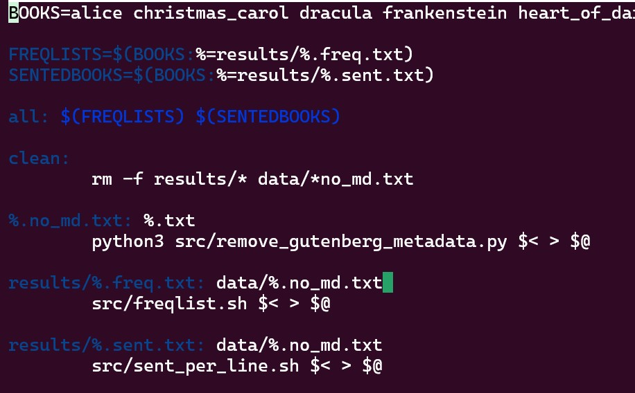

## Introduction

This page is a summary of the contents of the course *Command Line Tools for Linguists* offered at the University of Helsinki. The contents of the course included an intoroduction to the UNIX command line enviroment and the use of command line tools likely to be useful for linguists. The course was aimed at novices in using the command line environment. After an introducton to the basics of using a UNIX system, the course introduces various tools for managing, processing, and manipulating text files. These tools are then used to create pipelines for text file processing, which in turn are used in scipts made to automate their execution. The course then introduces project building tools like `make` and project and version management tools like Git. Finally all the skills learned in this course are use to create this very GitHub hosted website.

## Week 1: Introduction to Command Line Environments
The first week began by installing a command-line environment. In my case I used Ubuntu through WLS2, as I am a windows user. We then proceeded to familiarise ourselves with the basics of interacting with the command line. This included basic commands, such as:


| Command       | Description                        |
| ------------- | ---------------------------------- |
| `wget <URL>`  | Download a file from URL           |
| `ls`          | List contents of current directory |
| `pwd`         | Prints Current directory           |
| `whoami`      | Print current user                 |
| `mv`          | Move or rename file                | 
| `cat`         | Concatenate and print |
| `less` | Display file contents one page at a time|
| `cp` | Copy file to destination |
| `rm` | Remove file or directory |
| `mkdir` | Create directory |
| `cd` | Change working directory |

We then learned about quitting applications, which, deppending on the context, can be done with `Ctrl-d`, `Ctrl-c`, `Ctrl-x`, or `ESC`. Unfortunately, there is no universal way to quit applications and each one can potentially have their own. 

We then learned about text editors, like nano, and learned about the difference between text files and binary files. 

Beign a basic introcution to the command line, all of this week's information was useful to me in completing this course. By far the most useful part was discovering that I can use Linux on my Windows computer. I had previously tried to use PowerShell for some things, but that had proven somewhat too clunky to use regularly. Having WSL on my computer will, and indeed has, proven to be extremely useful. 


## Week 2: Navigating a UNIX system

The material for week 2 concerned the details of using the UNIX system. This included:

- Directories
	- Creating directories using `mkdir`
	- Deleting directories and their contents using `rm -R`
	- Copying directories using `cp -R`
	- Moving directories using `mv`
- UNIX file system 
	- The top most directory is called the root directory
		- The root directory's path is `/`
		- All other directories are sub-directories of the root directory
			- For example, all user home directories are contained in `/Users/`
			- `/bin/` contains essential user command binaries, such as the commands listed under Week 1
	- The `which` is used to locate the directory of a given command
	- The UNIX file system limits permissions for each file and directory. Permissions for reading, writing, and executing files can be individually configured for each user, group, and global user. 
		- These permissions can be managed using the command `chmod`.


We then went over how processes work. Running a command or programme starts a process. The operating system gives each program a process id for the purposes of keeping track of it. The command `top` can be used to see all processes currently running. By default, processes run in the forground, meaning once a process is started from the command line, the system will complete that process until a new command can be run. A process that is running in the foreground can be stoped using `Ctrl-C`. The command `ps aux` lists all currently running processes and their process ids. A process can be killed using the command `kill -9 <pid>`.

We then went over connecting to a remote server using `ssh` and securely copying onto one using `scp`. We also went over the basics of how to work on remote servers using the command line.

The material for this week was a good introduction to fundamental aspects of working in a UNIX system, and have proven to be very useful. I have not had cause yet to, for example, kill a process, but it is nevertheless valuable information for the future.

## Week 3: Basic Corpus Processing

Week 3 dealt with text processing tools. We learned about different character encodings, such as ASCII and utf-8. We used the command `file` to identify the encoding used in a text file, and how to convert the encoding of a text file using the command `iconv`. We also learned that Windows handles text files slightly differently from UNIX systems in that the new line symbol `\n` is accompanied by a carriage return symbol. Windows style text files can be converted to UNIX style files using the command `dos2unix`.

We then learned to modify and process files in various ways:

- The command `tr` can be used to transform characters to other characters
	- For example `tr 'A' 'a'` would transform all capital a's to lowercase
	- This command can also be used with POSIX character classes
- We learned to redirect the output of a command using the `>` symbol.
- The command `sort` command will sort the file given as an argument
	- `-f` can be added to ignore case
- The command `uniq` can be used to include only unique items in a file. Adding the option `-i` makes the command ignores case.

We then went over the basics of regular expressions (regex), which can be used to define a pattern of text. These patterns can then be used to match strings in a text. Regex is very powerful but can also be quite tricky to use.

Next we learned to use the command `egrep` which scans a file and returns each line that matches the pattern given as an argument. 

The tools thought this week have proven to be very useful for dealing with text files both during this course and outside of it. As I am currently taking courses in corpus linguistics in the English studies programme, knowing how to navigate different file types and processing text has proven a valuable skill. 


## Week 4: Advanced Corpus Processing

Continuing for last week, the materials for week 4 entailed further text processing. This included the command `sed`, which is used for various text processing and manipulation purposes. `sed` can be used with regular expressions and its uses are plentiful and powerful.

We also learned about text processing pipelines: stringing together commands using `|` between commands into a long series of commands which perform some complicated function. For examle:


In the above image, the pipeline takes a text file, converts it to UNIX format, replaces spaces with a new line, removes punctuation, sorts the list, keeps only unique items and prefixes them with a count number, sorts the list numerically in reverse order, and finally prints the first 10 lines. These kinds of pipelines can be customised and used to process large quantities of files.

As stated in preveious week's entry these kinds of text processing methods have proven very useful in corpus linguistics projects and I have been using the regularly outside of this course.  


## Week 5: Scripting and Configuration Files

Week 5 dealt with creating scrips which take pipelines of commands and store them in a covenient executable file. Scripts are text files which take the suffix `.sh`. For this course we used Bash scripts. Bash scripts can include anything you would normally run on the command line. To run a Bash script the user has to have executing premissions on the sript file, which can be enable by, for example, the command `chmod 755 <sript_file_name>.sh`. Bash script files begin with `#!` (known as a shebang) followed by /bin/bash, which specifies the programme to be used to run the script. Bash scripts can take command line perameters and use them in the script. For examle if the script is run with `script.sh file1.txt`, file1 can be referenced in the script with the symbol `$1`. Fruther paramaters can also be passed and they take sequential numbers after the dollar sign (e.g., `$2`, `$3`, etc.). The script name can be referenced using `$0` Bash scripts can also include if statements making it possible to deal with all kinds of circumstances.

We the moved on to learn about enviroment variables. Enviroment variables are global variables which can be accessed by all processes. Currently environment variables can be viewed with the command `printenv`. Of particular note in relation to scripts is the `$PATH` variable which contains all the directories where programmes are located. For example when running a Bash command such as `cat`, the system looks for the programme in the directories listed in the $PATH variable. For this reason, bash scripts can by default only be run using the command `./script.sh`, using the absolute path to the script, as Bash has no way of finding it unless its path is stored in the `$PATH` variable. Should we want a script or programme to be found in the `$PATH` variable, we can add the path with the command `export PATH=$PATH:~/script.sh`, which would make that script available directly from the command line without requiring the exact path. This change to the variable would only apply to the current terminal. If we want to make this change permanent and available to other terminals we can add the command to the configuration file, `~/.bashrc` for example.

By editing this configuration file we can also create aliases. In my case, added the following aliases for the `ls` command to make using its options more convenient:

```
alias lsa='ls -la --color=auto'
alias lsl='ls -l --color=auto'
```

Using scripts will no doubt be very useful for me in the future, but writing bash script seems to require quite a lot of practise. The applications are endless though, and I feel I recived a good introduction to these concepts from this weeks materials.

## Week 6: Installing and Running Programs

Week 6 was concerned with installing programmes. We began by setting a root user pasword using `sudo passwd`, and gaining root access. We then moved on to using package managers, which handle the dependencies required for a programme to run. Essentially, package mangaers exist to make installing programmes as effortless for the user as possible.

We then moved on to installing python, so that we can run .py files from the command line, as well as running the python interpreter in the command line. Python itself also has a number of libraries which the user may want to use. These can be installed and managed from the command line using the `pip` command, for example `pip install nltk` which installs the `nltk` natural language tool kit for python. We also learned about using virtual enviroments, which makes handiling python version conflicts much easier. We can start a virtual python eviroment using, for example `python3 -m venv <directory>`, and then install whatever packages we want in that enviroment without risking those packages conflicting with other versions of python or its libraries.

We then learned about the Make utility, which is used to build projects. The make utility, takes a `Makefile`, which defines what task are to be executed. In much the same way as a function in a programming language a `Makefile` defines a set of *targets* with instruction on how to reach that target. For example:



In the above image a number of targets for creating various processed text files are defined. The make utility will create each type of file as defined by the targets based on the instructions it is given.

For this weeks contents I found the installing part to be quite straight forward. I had already used `pip` to install libraries in Python, but using virtual environments was new to me, and I can definitely see that being useful in the future. I found Makefiles to be by far the most challenging part of this course, as the syntax was rather difficult to deal with. Still, I definitely think getting an introduction to it to be beneficial in the future, as I see its utility. 

## Week 7: Version Control

For week 7 we about version controll using Git and GitHub. Git enables one edit mostly text-based projects with out fear of ruining previous work. Git can be used to restore previous versions of a project and to create *branches* so that experimental approaches can be tried out without interfearing with a stable version of project. GitHub is a platform for sharing git repositories to enable multiple people to work on a single project, as well as creating *forks* of projects which may head in an entirely different direction form the original. 

We began by installing Git and configuring, and learning the basic workflow for using Git, as follows:

1. We can initialise a Git repository using the command `git init` or by cloning a repository from GitHub using the command `git clone <git_repo_URL>`.
2. We stage updates to the repository with the command `git add .`, which stages all changes from the the previously commited version to be commited.
	- We can also stage specific files to be staged with `git add <path>`
3. We commit updates using `git commit -m "Update message"`, which commits all staged changes to the repository
	- It is important to be as specific as possible in the update message as to what changes have been made, to make it easier to return to a previous version of the project.
4. We push these updates to the remote repository using `git push origin <branch to be updated>` 
	- If you are working with other people, it is important to pull updates made to the remote repository using `git pull origin <brach to be pulled>`

For the most part, the four above steps are the basic workflow for working with Git. Other useful commands include `git log` which prints a log of previous changes, and `git status`, which gives information about which chages are untracked, how many commits the local file repository is ahead of the remote repository, etc.

From this week's materials, I learned the basics of using Git, which I found to be very useful, especially for larger coding projects. I have indeed started using Git in my own projects, albeit locally, as I am not interested in sharing them at this stage.
